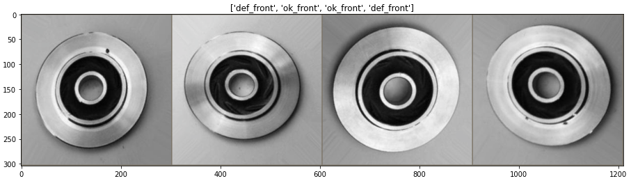

# Image-Classification-Pytorch
Image classification with Pytorch and model interpretability. 

## Setup Environment
Before running the code, you must setup the python environment that's specified within the `environment.yml` file. To do so, run the following commands within your terminal:
<ul>
    <li><code>$ conda env create -f environment.yml</code></li>
    <li><code>$ conda activate pytorch_img_classif</code></li>
</ul>
In case you want to remove this environment later on, use the following command: 
<code>$ conda remove --name pytorch_img_classif --all</code>

## Model training
The code for model training is contained in the `transfer_learning.ipynb` notebook which must be run as a standalone script. This code also performs model evaluation and the computation of GradCAM heatmaps.

 In order to run the script, make sure you have updated the `data_dir` python variable which must contain the path to the folder containing your dataset. This folder must have the following structure:
<code>
├── train                    
│   ├── img_train_1.png         
│   └── img_train_2.png   
├── test  
│   ├── img_test_1.png         
│   └── img_test_2.png  
</code>

## Results
This repository contains the results obtained when running this transfer learning code on the VGG16 using the [casting defect detection dataset](https://www.kaggle.com/ravirajsinh45/real-life-industrial-dataset-of-casting-product) from Kaggle. This dataset contains images of casting manufacturing products and the underlying problem consists in classifying them based on whether the products are defective or not. 

The first attempts gave an accuracy that greater that 95%. Besides that, GradCAM heatmaps show meaningful results on test images insofar as most of the defects are highlighted by the method (see figure below).

